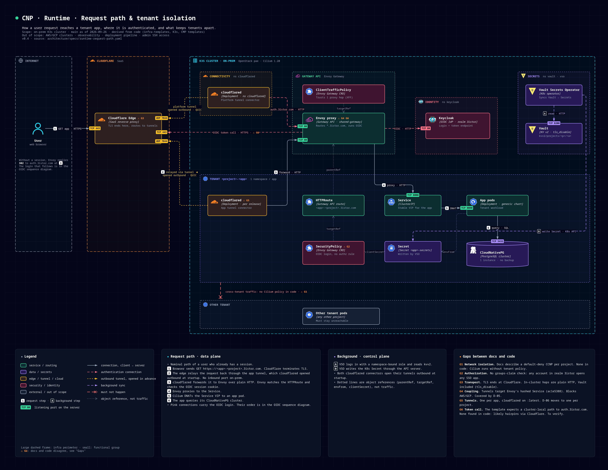

# Noodle 🍜

Take the spaghetti out of a large architecture and keep it clear.

Noodle turns an architecture described as code into readable, presentation-grade
diagrams, and aims further: interactive views, guided tours, visual PR diffs, discovery
from real clusters, live overlays, and a model AI agents can query.
See [the vision](docs/VISION.md).



## Status

**v0.** One generator turns a single YAML spec into draw.io in a dark or light theme. It
refuses to emit a diagram whose lines cross boxes, whose labels collide, or whose arrows
break the connection semantics. The next phase splits the spec into model, views and
layout ([roadmap](docs/ROADMAP.md)).

## Install

### As a Claude Code plugin (skill + `noodle` command)

```
/plugin marketplace add TheGostsniperfr/Noodle
/plugin install noodle@noodle
```

Then enable auto-update once, under **Marketplaces** in `/plugin`, to follow `main`.
The plugin puts `noodle` on the PATH. On first use it builds itself from the plugin's
sources with Go, or with Nix; a `noodle` already on the PATH wins. PNG and SVG exports
also need [draw.io desktop](https://www.drawio.com/) (`drawio`).

To offer it to everyone working in a repository, run once there and commit the result:

```bash
claude plugin marketplace add TheGostsniperfr/Noodle --scope project
```

### With Nix

```nix
inputs.noodle.url = "github:TheGostsniperfr/Noodle";
# then: home.packages = [ inputs.noodle.packages.${pkgs.system}.default ];
```

or just `nix run github:TheGostsniperfr/Noodle -- -list-icons`.

## Usage

```bash
noodle spec.yaml                                   # lint only
noodle -theme dark -o out.drawio spec.yaml         # lint, then render
noodle -icons .noodle/icons -o out.drawio spec.yaml  # with project icons
noodle -list-icons
drawio -x -f png -s 2 --border 20 -o out.png out.drawio
```

The spec format is in [the skill reference](skills/noodle-diagram/reference.md).

## Docs

- [Vision](docs/VISION.md): the problem, principles and capability levels L0 to L6
- [Architecture](docs/ARCHITECTURE.md): modules, contracts, interfaces, storage and security
- [Progress](docs/PROGRESS.md): where the work stands and where the next session starts
- [Roadmap](docs/ROADMAP.md): phases and their exit criteria, checked in [features.json](docs/features.json)
- [Specs](specs/): one spec per piece of work, written before the code
- [Decisions](docs/adr/README.md): ADRs
- [Inspirations](docs/INSPIRATIONS.md): IcePanel, Ilograph, LikeC4 and others, and what we borrow
- [Diagram skill](skills/noodle-diagram/SKILL.md): the conventions an AI agent follows to write diagrams

## Development

```bash
nix develop
./scripts/init.sh        # vet, test, lint the example, validate the plugin, show next features
```

Dependencies are vendored (`go mod vendor`) so the plugin can build offline. Run
`go mod vendor` after changing `go.mod`.
